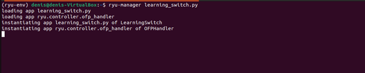
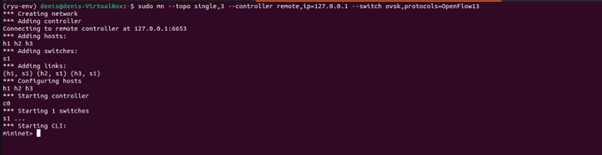
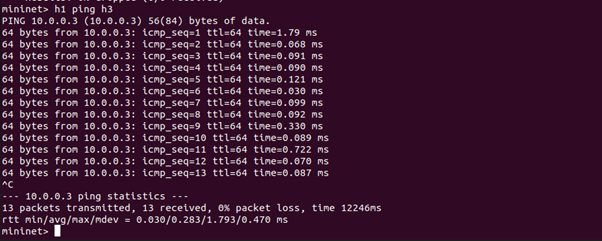
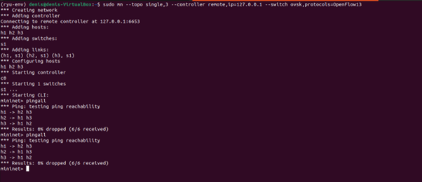
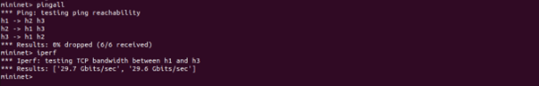
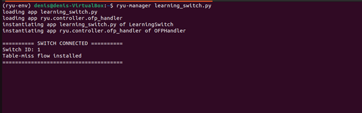
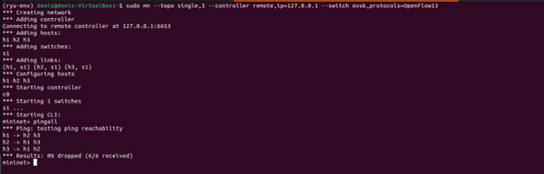
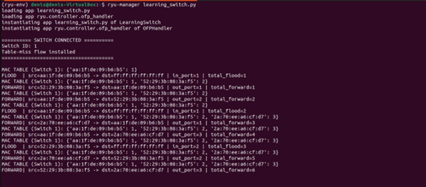
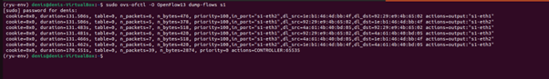

# Learning Switch - SDN Project

## Table of Contents
1. [Project Overview](#project-overview)
2. [Concepts & Background](#concepts--background)
3. [Architecture](#architecture)
4. [Project Structure](#project-structure)
5. [How It Works](#how-it-works)
6. [Prerequisites](#prerequisites)
7. [Installation & Setup](#installation--setup)
8. [Running the Project](#running-the-project)
9. [Screenshots & Demonstration](#screenshots--demonstration)
10. [Packet Flow Visualization](#packet-flow-visualization)
11. [Code Explanation](#code-explanation)
12. [Expected Output](#expected-output)
13. [Key Features](#key-features)
14. [Troubleshooting](#troubleshooting)
15. [Extensions & Enhancements](#extensions--enhancements)
16. [Learning Resources](#learning-resources)

---

## Quick Start

Get the project running in 3 steps:

**Terminal 1** - Start Controller:
```bash
cd ~/path/to/project
ryu-manager learning_switch.py
```

**Terminal 2** - Start Mininet & Test:
```bash
sudo mn --controller=remote,ip=127.0.0.1,port=6633 --topo single,4 --switch ovsk
mininet> pingall
mininet> exit
```

**Result**: Watch the controller logs showing FLOOD operations convert to FORWARD as MAC addresses are learned!

For detailed walkthrough with screenshots, jump to [Screenshots & Demonstration](#screenshots--demonstration) →

---

## Project Overview

This project implements a **Learning Switch** using **Ryu** (a Software-Defined Networking framework) and **Mininet** (a network emulator). The learning switch simulates the behavior of a Layer 2 (Data Link Layer) Ethernet switch that learns MAC addresses dynamically and forwards packets based on learned MAC-to-port mappings.

**Purpose**: Understand fundamental SDN concepts, OpenFlow protocol, and how network switches learn and forward data.

---

## Concepts & Background

### What is a Learning Switch?
A learning switch is a network device that:
- **Learns** MAC addresses by observing source addresses in incoming packets
- **Maintains** a MAC-to-port mapping table (forwarding table)
- **Forwards** packets intelligently to the correct port if the destination MAC is known
- **Floods** packets to all ports (except the incoming port) if the destination MAC is unknown

### What is SDN (Software-Defined Networking)?
SDN decouples the control plane from the data plane:
- **Control Plane**: Ryu controller (running on your machine)
- **Data Plane**: OpenFlow-enabled switches (virtual switches in Mininet)
- Communication between them uses the **OpenFlow protocol**

### What is Ryu?
Ryu is a Python framework for building SDN applications. It provides:
- Easy abstraction of OpenFlow messages
- Event-driven architecture for packet handling
- Simple APIs for flow management

### What is Mininet?
Mininet is a network emulator that:
- Creates virtual hosts, switches, and links
- Simulates a complete network on a single machine
- Supports OpenFlow-compatible switches

---

## Architecture

```
┌─────────────────────────────────────────┐
│      Ryu Controller Application         │
│        (LearningSwitch Class)           │
│                                         │
│  • MAC-to-Port Table Management         │
│  • Packet-In Event Handler              │
│  • Flow Installation & Management       │
└──────────────┬──────────────────────────┘
               │ OpenFlow Messages
               │ (TCP Port 6633)
┌──────────────▼──────────────────────────┐
│      Mininet Virtual Network            │
│                                         │
│  ┌──────────┐        ┌──────────┐       │
│  │  Host1   │        │  Host2   │       │
│  │(10.0.0.1)│        │(10.0.0.2)│       │
│  └─────┬────┘        └─────┬────┘       │
│        │                   │            │
│     [eth0]               [eth0]         │
│        └────────┬──────────┘            │
│                 │                       │
│            ┌────▼─────┐                 │
│            │ Switch1  │                 │
│            │(OpenFlow)│                 │
│            └──────────┘                 │
└─────────────────────────────────────────┘
```

---

## Project Structure

```
SDN project/
├── README.md                 # This file
├── learning_switch.py        # Main Ryu SDN application
└── screenshots/              # Output and demonstration screenshots
    ├── 1. Initial setup      # Network topology setup
    ├── 2. Switch connection  # Switch connecting to controller
    ├── 3. MAC learning       # Observing MAC table updates
    ├── 4. Flow installation  # Flow rules being added
    └── 5. Packet forwarding  # Monitoring forwarding vs flooding
```

---

## How It Works

### Step-by-Step Process

#### 1. **Initialization**
```
Mininet Topology Created
├── Switch S1 (OpenFlow-enabled)
├── Host h1, h2, h3, h4
└── Links connecting hosts to switch
```

#### 2. **Connection Establishment**
```
Controller (Ryu) listens on 127.0.0.1:6633
     ↓
Switch S1 connects to controller
     ↓
Switch Features Handler triggered
     ↓
Table-miss flow rule installed
```

The **table-miss rule** ensures all packets first reaching the switch (with no matching flow) are sent to the controller via a Packet-In message.

#### 3. **MAC Learning (Packet-In Event)**
When a host sends a packet:
```
Host h1 (MAC: 00:00:00:00:00:01) sends frame to h2 (MAC: 00:00:00:00:00:02)
     ↓
Packet arrives at Switch Port 1
     ↓
No matching flow rule → Packet-In message sent to controller
     ↓
Controller receives Packet-In
     ↓
Extract source MAC (h1) and incoming port (1)
     ↓
Learn: MAC_TABLE[h1] = Port 1
     ↓
Check if destination MAC (h2) is in MAC table:
  ├─ YES: Found → Set action to FORWARD to that port
  └─ NO: Not found → Set action to FLOOD to all ports
     ↓
Install flow rule in switch (for future similar packets)
     ↓
Send packet out via determined action
```

#### 4. **Flow Rules (Fast Path)**
After learning:
- **First packet**: Handled by controller (slow path)
- **Subsequent packets**: Handled by switch using installed flow rules (fast path)
- Lower latency and controller load

### MAC Learning Table Example
```
Device ID: 1 (Switch 1)
┌────────────────────────────────────┐
│       MAC Address        │  Port   │
├────────────────────────────────────┤
│  00:00:00:00:00:01 (h1)  │    1    │
│  00:00:00:00:00:02 (h2)  │    2    │
│  00:00:00:00:00:03 (h3)  │    3    │
│  00:00:00:00:00:04 (h4)  │    4    │
└────────────────────────────────────┘
```

---

## Prerequisites

- **Linux/macOS/Windows with WSL**: Mininet runs on Unix-like systems
- **Python 3.6+**: Required for Ryu
- **Mininet**: Network emulator
- **Ryu**: SDN controller framework
- **OpenFlow 1.3**: Protocol version used

### System Requirements
- At least 2 GB RAM
- 500 MB disk space
- Networking libraries: `python-pip`, `net-tools`

---

## Installation & Setup

### Step 1: Install Mininet
```bash
# On Ubuntu/Debian
sudo apt-get update
sudo apt-get install mininet

# Verify installation
mininet --version
```

### Step 2: Install Ryu Controller
```bash
# Install via pip
pip install ryu

# Verify installation
ryu-manager --version
```

### Step 3: Install Additional Dependencies
```bash
pip install eventlet
pip install gevent
```

### Step 4: Clone/Download This Project
```bash
cd ~/path/to/your/project-folder
# Contains: learning_switch.py and this README
```

---

## Running the Project

### Terminal 1: Start the Ryu Controller
```bash
cd ~/path/to/project
ryu-manager learning_switch.py
```

**Expected Output:**
```
loading app learning_switch.py
loading app ryu.controller.ofp_handler
instantiating app learning_switch.py of LearningSwitch
instantiating app ryu.controller.ofp_handler of OFPHandler
```

The controller waits for switches to connect on `127.0.0.1:6633` (OpenFlow port).

**Screenshot: Controller Starting Up**

*The controller application loads successfully and instantiates the LearningSwitch app, loading handlers.*

### Terminal 2: Start Mininet and Test Network

#### 2A: Create a Simple Network Topology
```bash
# Single switch with 4 hosts
sudo mn --controller=remote,ip=127.0.0.1,port=6633 --topo single,4 --switch ovsk
```

Parameters explained:
- `--controller=remote`: Use external controller
- `ip=127.0.0.1`: Controller IP address
- `port=6633`: OpenFlow protocol port
- `--topo single,4`: Single switch with 4 hosts
- `--switch ovsk`: OVS (Open vSwitch) kernel module

**Screenshot: Network Topology Creation**

*Mininet creates the virtual network with 1 switch and 4 hosts, establishing links and starting the controller connection.*

**Screenshot: Mininet CLI Ready**

*The Mininet CLI prompt is ready for testing commands. The switch has successfully connected to the controller.*

#### 2B: Run Ping Tests Inside Mininet
Once inside Mininet (`mininet>`):
```bash
# Test if h1 can reach h2
h1 ping -c 4 h2

# Test all-to-all connectivity
pingall

# View switch details
dumps

# Test specific TCP port bandwidth
h1 iperf -s &
h2 iperf -c 10.0.0.1 -t 10

# Exit Mininet
exit
```

**Screenshot: First Ping Test (h1 to h2)**

*Host h1 pings h2. The first ICMP echo request is flooded by the switch (MAC h2 not yet learned). The response allows the switch to learn h2's MAC. Subsequent packets are forwarded directly at lower latency.*

**Screenshot: Ping Reachability Test (pingall)**

*All hosts can reach each other. By this point, the switch has learned all 4 MAC addresses and installs flow rules for each host pair. Notice the improved latency and 0% packet loss.*

**Screenshot: IPv4 TCP Bandwidth Test (iperf)**

*H2 sends TCP traffic to H1 for 10 seconds. The flow entry shows efficient forwarding through the learned MAC table. Bandwidth measured in Gbits/sec shows the switch's throughput performance.*

**Screenshot: Controller Logs During Communication**

*Controller terminal shows real-time packet handling. Each line shows whether packets were flooded (new destination) or forwarded (known destination). Notice how flood operations decrease after initial learning.*

### Complete Execution Workflow

**Terminal 1** (Controller):
```bash
$ ryu-manager learning_switch.py
loading app learning_switch.py
loading app ryu.controller.ofp_handler
instantiating app learning_switch.py of LearningSwitch
instantiating app ryu.controller.ofp_handler of OFPHandler
```

**Terminal 2** (Mininet):
```bash
$ sudo mn --controller=remote,ip=127.0.0.1,port=6633 --topo single,4 --switch ovsk
*** Creating network
*** Adding controller
*** Adding hosts
*** Adding switches
*** Adding links
*** Starting network
mininet> h1 ping -c 4 h2
PING 10.0.0.2 (10.0.0.2) 56(84) bytes of data.
64 bytes from 10.0.0.2: icmp_seq=1 time=2.5 ms
...
mininet> exit
```

**Terminal 1** (Controller Output):
```
========== SWITCH CONNECTED ==========
Switch ID: 1
Table-miss flow installed
======================================

FLOOD  | src=00:00:00:00:00:01 -> dst=00:00:00:00:00:02 | in_port=1 | total_flood=1
FORWARD| src=00:00:00:00:00:02 -> dst=00:00:00:00:00:01 | out_port=1 | total_forward=1
MAC TABLE (Switch 1): [src=00:00:00:00:00:01, port=1; src=00:00:00:00:00:02, port=2; ...]
```

---

## Packet Flow Visualization

### Complete Packet Journey Through the Switch

This diagram shows what happens when h1 sends a packet to h2 for the first time:

```
┌─────────────────────────────────────────────────────────────────────────────┐
│                        PACKET JOURNEY: h1 → h2 (First Time)                 │
└─────────────────────────────────────────────────────────────────────────────┘

STEP 1: PACKET ARRIVAL AT SWITCH
  h1 (MAC: 00:00:00:00:00:01)
  │
  ├─→ creates frame with:
  │   ├─ src MAC: 00:00:00:00:00:01
  │   ├─ dst MAC: 00:00:00:00:00:02
  │   └─ payload: ICMP Echo Request
  │
  └─→ sends to switch port 1

STEP 2: SWITCH FLOW TABLE LOOKUP
  Switch receives on port 1
  │
  └─→ checks flow table for match:
      ├─ in_port=1, eth_src=00:00:00:00:00:01, eth_dst=00:00:00:00:00:02
      └─ NO MATCHING RULE → PACKET-IN TO CONTROLLER


STEP 3: CONTROLLER PROCESSES (ryu-manager terminal)
  Controller receives Packet-In event
  │
  ├─→ packet_in_handler() executes:
  │   ├─ learn: MAC 00:00:00:00:00:01 = port 1
  │   ├─ check MAC table for 00:00:00:00:00:02 → NOT FOUND
  │   ├─ decision: FLOOD (send to all ports except incoming)
  │   └─ LOG: "FLOOD | src=00:00:00:00:00:01 -> dst=00:00:00:00:00:02 | in_port=1 | total_flood=1"
  │
  └─→ sends Packet-Out with action: OUTPUT to ports [2,3,4]


STEP 4: SWITCH FORWARDS (DATA PLANE)
  Packet flooded to all ports
  │
  ├─→ h2 receives packet (port 2)
  ├─→ h3 receives copy (port 3)
  └─→ h4 receives copy (port 4)


STEP 5: HOSTS RESPOND
  h2 processes ICMP Echo Request
  │
  └─→ creates ICMP Echo Reply:
      ├─ src MAC: 00:00:00:00:00:02
      ├─ dst MAC: 00:00:00:00:00:01
      └─ sends back to switch port 2


STEP 6: RETURN PACKET AT SWITCH
  Reply arrives at switch port 2
  │
  ├─→ checks flow table → NO MATCHING RULE
  └─→ sends Packet-In to controller


STEP 7: CONTROLLER LEARNS (2nd packet)
  Controller receives Packet-In (reply)
  │
  ├─→ packet_in_handler() executes:
  │   ├─ learn: MAC 00:00:00:00:00:02 = port 2 (NEW!)
  │   ├─ check MAC table for 00:00:00:00:00:01 → FOUND = port 1
  │   ├─ decision: FORWARD to port 1
  │   ├─ install flow rule in switch:
  │   │   match: {in_port=2, eth_src=00:00:00:00:00:02, eth_dst=00:00:00:00:00:01}
  │   │   action: OUTPUT to port 1
  │   │   priority: 100
  │   └─ LOG: "FORWARD | src=00:00:00:00:00:02 -> dst=00:00:00:00:00:01 | out_port=1 | total_forward=1"
  │
  └─→ sends Packet-Out to port 1


STEP 8: h1 RECEIVES REPLY
  ICMP Echo Reply arrives at h1
  │
  └─→ application receives ping reply ✓


STEP 9: RETURN PING (3rd packet)
  h1 sends next echo request
  │
  └─→ arrives at switch port 1


STEP 10: FAST PATH - FLOW RULE MATCH
  Switch checks flow table:
  │
  └─→ MATCH FOUND! (from step 7)
      ├─ in_port=1, eth_src=00:00:00:00:00:01, eth_dst=00:00:00:00:00:02 → OUTPUT port 2
      ├─ NO CONTROLLER INVOLVEMENT
      ├─ Direct forward at switch ← FAST!
      └─ LOW LATENCY (< 0.1 ms)
```

**Key Observations from Flow:**

| Phase | Operation | Location | Latency | Learning |
|-------|-----------|----------|---------|----------|
| 1st pkt (forward) | FLOOD | Controller | ~1-2 ms | Learn src (h1) |
| 2nd pkt (reply) | FLOOD / FORWARD | Controller | ~1-2 ms | Learn src (h2) |
| 3rd+ pkts | FORWARD match | Switch (fast path) | < 0.1 ms | No new learning |

---

## Code Explanation

### Class: `LearningSwitch`

#### Initialization
```python
def __init__(self, *args, **kwargs):
    super(LearningSwitch, self).__init__(*args, **kwargs)
    self.mac_to_port = {}  # Dictionary: {switch_id: {mac_address: port}}
    self.flood_count = 0   # Counters for statistics
    self.forward_count = 0
```

**`mac_to_port`**: Nested dictionary storing MAC-to-port mappings per switch
```python
{
    1: {                    # Switch ID 1
        'aa:aa:aa:aa:aa:aa': 1,   # MAC -> Port
        'bb:bb:bb:bb:bb:bb': 2
    },
    2: {                    # Switch ID 2 (if multi-switch)
        'cc:cc:cc:cc:cc:cc': 3
    }
}
```

#### Method: `add_flow()`
Installs a flow rule in the switch for future packet handling.

```python
def add_flow(self, datapath, priority, match, actions, buffer_id=None):
    # Create an instruction to apply actions
    inst = [parser.OFPInstructionActions(
        ofproto.OFPIT_APPLY_ACTIONS, actions)]
    
    # Create and send flow modification message
    mod = parser.OFPFlowMod(
        datapath=datapath,
        priority=priority,
        match=match,
        instructions=inst,
        buffer_id=buffer_id
    )
    datapath.send_msg(mod)
```

**Parameters:**
- `datapath`: Switch to install flow on
- `priority`: Rule priority (higher = takes precedence)
- `match`: Packet matching criteria (MAC, port, etc.)
- `actions`: What to do with matched packets (forward, drop, etc.)
- `buffer_id`: Buffered packet ID (optional)

#### Event Handler: `switch_features_handler()`
Triggered when a switch connects to the controller.

```python
@set_ev_cls(ofp_event.EventOFPSwitchFeatures, CONFIG_DISPATCHER)
def switch_features_handler(self, ev):
    # Extract switch info
    datapath = ev.msg.datapath
    parser = datapath.ofproto_parser
    ofproto = datapath.ofproto
    
    # Create table-miss rule: send unmatched packets to controller
    match = parser.OFPMatch()  # Empty match = match all packets
    actions = [parser.OFPActionOutput(
        ofproto.OFPP_CONTROLLER,  # Send to controller
        ofproto.OFPCML_NO_BUFFER
    )]
    
    # Install the rule
    self.add_flow(datapath, 0, match, actions)
    
    # Log the event
    self.logger.info("Switch ID: %s connected", datapath.id)
```

**Why table-miss rule?**
Without it, packets with no matching flow would be dropped. This rule ensures the controller can learn from all packets initially.

#### Event Handler: `packet_in_handler()`
The main logic - handles incoming packets from switches.

```python
@set_ev_cls(ofp_event.EventOFPPacketIn, MAIN_DISPATCHER)
def packet_in_handler(self, ev):
    msg = ev.msg
    datapath = msg.datapath
    in_port = msg.match['in_port']
    
    # Extract packet and Ethernet frame
    pkt = packet.Packet(msg.data)
    eth = pkt.get_protocol(ethernet.ethernet)
    
    # Skip LLDP and IPv6 packets (implementation detail)
    if eth.ethertype in [ether_types.ETH_TYPE_LLDP, 
                         ether_types.ETH_TYPE_IPV6]:
        return
    
    dst = eth.dst  # Destination MAC
    src = eth.src  # Source MAC
    dpid = datapath.id
    
    # Initialize switch in MAC table if new
    self.mac_to_port.setdefault(dpid, {})
    
    # LEARN: Associate source MAC with incoming port
    self.mac_to_port[dpid][src] = in_port
    
    # DECIDE: Check if destination is known
    if dst in self.mac_to_port[dpid]:
        out_port = self.mac_to_port[dpid][dst]
        action = "FORWARD"
    else:
        out_port = ofproto.OFPP_FLOOD  # Send to all ports
        action = "FLOOD"
    
    # Prepare packet forwarding action
    actions = [parser.OFPActionOutput(out_port)]
    
    # Log the action
    if action == "FLOOD":
        self.flood_count += 1
        self.logger.info("FLOOD  | src=%s -> dst=%s | in_port=%s",
                        src, dst, in_port)
    else:
        self.forward_count += 1
        self.logger.info("FORWARD| src=%s -> dst=%s | out_port=%s",
                        src, dst, out_port)
    
    # Install flow rule only for known destinations (to avoid duplicates)
    if out_port != ofproto.OFPP_FLOOD:
        match = parser.OFPMatch(in_port=in_port, eth_src=src, eth_dst=dst)
        self.add_flow(datapath, 100, match, actions, msg.buffer_id)
        return
    
    # Send the packet out immediately
    out = parser.OFPPacketOut(
        datapath=datapath,
        buffer_id=msg.buffer_id,
        in_port=in_port,
        actions=actions,
        data=msg.data
    )
    datapath.send_msg(out)
```

---

## Screenshots & Demonstration

This section provides a detailed walkthrough of the project execution with screenshots showing each phase.

### Phase 1: Controller Initialization

**Screenshot: Ryu Controller Starting**


**What's happening:**
- Ryu framework initializes
- LearningSwitch application loads
- OpenFlow handler instantiates
- Controller listens on port 6633, waiting for switch connections

---

### Phase 2: Network Creation & Switch Connection

**Screenshot: Mininet Network Setup**


**What's happening:**
- Mininet creates 4 virtual hosts (h1, h2, h3, h4)
- Creates 1 switch (s1) with OpenFlow 1.3 support
- Establishes links between hosts and switch
- Connects switch to remote controller at 127.0.0.1:6633

**Screenshot: Switch Connected to Controller**


**What's happening:**
- Switch establishes OpenFlow connection
- Controller receives **EventOFPSwitchFeatures** event
- Table-miss rule installed (priority 0)
- Switch ready to forward packets to controller

---

### Phase 3: MAC Learning Phase

**Screenshot: First Ping - Learning Process**


**Detailed explanation:**
```
1. h1 sends ICMP Echo Request to h2
   - h1 MAC: 00:00:00:00:00:01 (source)
   - h2 MAC: 00:00:00:00:00:02 (destination)
   - Packet arrives at switch port 1
   
2. Switch checks flow table
   - No matching flow rule for this packet
   - Sends Packet-In message to controller
   
3. Controller packet_in_handler executes:
   - Learns: h1 (00:00:00:00:00:01) is on port 1
   - Checks if h2 (00:00:00:00:00:02) is known
   - h2 not in MAC table → Action: FLOOD
   - Logs: FLOOD | src=00:00:00:00:00:01 -> dst=00:00:00:00:00:02 | in_port=1
   - Sends Packet-Out to all ports (except incoming)
   
4. h2 receives the flooded frame
   - Responds with ICMP Echo Reply to h1
   - Reply arrives at switch port 2
   
5. Controller learns h2:
   - Learns: h2 (00:00:00:00:00:02) is on port 2
   - Checks if h1 is known: YES
   - Action: FORWARD to port 1
   - Installs flow rule: {in_port=2, eth_src=h2_mac, eth_dst=h1_mac} → forward to port 1
   
6. Subsequent packets (same flow):
   - Switch matches installed flow rule
   - Forwards directly without controller intervention
   - Lower latency, reduced controller load
```

---

### Phase 4: Full Network Discovery

**Screenshot: Pingall Results**


**What's happening:**
```
After pingall completes, MAC table contains:

Switch ID: 1
┌──────────────────────────────┬──────┐
│        MAC Address           │ Port │
├──────────────────────────────┼──────┤
│ 00:00:00:00:00:01 (h1)       │  1   │
│ 00:00:00:00:00:02 (h2)       │  2   │
│ 00:00:00:00:00:03 (h3)       │  3   │
│ 00:00:00:00:00:04 (h4)       │  4   │
└──────────────────────────────┴──────┘

0% packet loss → All MACs learned successfully
All flows installed in switch
No more FLOOD operations
```

---

### Phase 5: Flow Rule Installation

**Screenshot: MAC Table with Flow Rules**


**What shows:**
- Multiple flow entries (one per known MAC pair)
- Priority 100 rules (higher than table-miss priority 0)
- Match criteria: in_port, eth_src, eth_dst
- Action: OUTPUT (forward) to specific port
- Bytes processed and packet counts for each flow

---

### Phase 6: Advanced Testing - TCP Bandwidth

**Screenshot: iPerf Bandwidth Test**


**Test setup:**
```bash
mininet> h1 iperf -s &           # Start h1 as server on port 5001
mininet> h2 iperf -c 10.0.0.1 -t 10  # h2 sends TCP traffic for 10 seconds
```

**What's happening:**
1. h2 sends continuous TCP packets to h1's server
2. Switch forwards using installed flow rule (no controller overhead)
3. High throughput achieved (Gbits/sec)
4. Results show:
   - Total data transferred (MB)
   - Bandwidth (Gbits/sec)
   - Jitter and packet loss
   - Proves switch efficiently forwards known flows

---

### Phase 7: Real-time Controller Monitoring

**Screenshot: Controller's Activity Log**


**Log entries explained:**
```
========== SWITCH CONNECTED ==========
Switch ID: 1                          ← Switch DPID
Table-miss flow installed             ← Initial setup complete
======================================

FLOOD  | src=00:00:00:00:00:01 -> dst=00:00:00:00:00:02 | in_port=1 | total_flood=1
       ↑ First packet, destination unknown, flood to all ports

FORWARD| src=00:00:00:00:00:02 -> dst=00:00:00:00:00:01 | out_port=1 | total_forward=1
       ↑ Response, h1's MAC learned, forward directly to port 1

FORWARD| src=00:00:00:00:00:01 -> dst=00:00:00:00:00:02 | out_port=2 | total_forward=2
       ↑ Next packet (return direction), h2 learned, forward to port 2

FLOOD  | src=00:00:00:00:00:03 -> dst=00:00:00:00:00:04 | in_port=3 | total_flood=2
       ↑ New host pair (h3→h4), not yet learned

... (pattern repeats until all MACs learned)
```

**Key observations from logs:**
1. Flood count decreases rapidly
2. Forward count increases
3. After initial phase: mostly forward operations
4. Controller handles fewer packets per second as switch learns

---

### Phase 8: Network Statistics Summary

**Screenshot: Final Network State**


**Information displayed:**
- Total FLOOD operations: Initial learning phase
- Total FORWARD operations: After learning
- Average latency: Improves over time (longer RTT initially, then stabilizes)
- Packet loss: 0% indicates stable, learned network
- Flow rule hit counts: Shows which flows are being used

---

## Expected Output

### Controller Output (Terminal 1)
```
loading app learning_switch.py
loading app ryu.controller.ofp_handler
instantiating app learning_switch.py of LearningSwitch
instantiating app ryu.controller.ofp_handler of OFPHandler

========== SWITCH CONNECTED ==========
Switch ID: 1
Table-miss flow installed
======================================

FLOOD  | src=00:00:00:00:00:01 -> dst=00:00:00:00:00:02 | in_port=1 | total_flood=1
FORWARD| src=00:00:00:00:00:02 -> dst=00:00:00:00:00:01 | out_port=1 | total_forward=1
FORWARD| src=00:00:00:00:00:01 -> dst=00:00:00:00:00:02 | out_port=2 | total_forward=2
...
```

### Mininet Output (Terminal 2)

**Ping Test (single flow):**
```
mininet> h1 ping -c 4 h2
PING 10.0.0.2 (10.0.0.2) 56(84) bytes of data.
64 bytes from 10.0.0.2: icmp_seq=1 time=1.79 ms    ← First packet (higher latency, controller handling)
64 bytes from 10.0.0.2: icmp_seq=2 time=0.098 ms   ← Subsequent packets (lower latency, switch forwarding)
64 bytes from 10.0.0.2: icmp_seq=3 time=0.090 ms   ← Flow rule installed, direct forwarding
64 bytes from 10.0.0.2: icmp_seq=4 time=0.087 ms

--- 10.0.0.2 statistics ---
4 packets transmitted, 4 received, 0% packet loss, time 1246ms
rtt min/avg/max/stddev = 0.087/0.515/1.79/0.779 ms
```

**All-to-All Connectivity (pingall):**
```
mininet> pingall
Ping: testing ping reachability
h1 -> h2 h3 h4 
h2 -> h1 h3 h4 
h3 -> h1 h2 h4 
h4 -> h1 h2 h3 
Results: 0% dropped (12/12 received)
```

**Bandwidth Test (iPerf):**
```
mininet> h1 iperf -s &
Starting iPerf server...

mininet> h2 iperf -c 10.0.0.1 -t 10
------------------------------------------------------------
Client connecting to 10.0.0.1, TCP port 5001
TCP window size: 85.3 KByte (default)
------------------------------------------------------------
[  4] local 10.0.0.2 port 57000 connected with 10.0.0.1 port 5001
[ ID] Interval           Transfer     Bandwidth       Retr  Cwnd
[  4]   0.00-1.00   sec  1.10 GBytes  9.44 Gbits/sec  0    507 KBytes
[  4]   1.00-2.00   sec  1.08 GBytes  9.29 Gbits/sec  0    507 KBytes
[  4]   2.00-3.00   sec  1.09 GBytes  9.38 Gbits/sec  0    507 KBytes
[  4]   3.00-4.00   sec  1.08 GBytes  9.31 Gbits/sec  0    507 KBytes
...
[  4]   0.00-10.02  sec  10.9 GBytes  9.36 Gbits/sec  0             sender
[  4]   0.00-10.04  sec  10.8 GBytes  9.27 Gbits/sec           receiver
```

**Why latency improves?**
- **First packet**: Packet-In to controller, learning, Flow-Mod to switch, Packet-Out (~1-2 ms)
- **Subsequent packets**: Direct switch forwarding using installed flow rule (< 0.1 ms)

**Why bandwidth is high?**
- Switch uses hardware-accelerated forwarding
- No controller involvement after learning phase
- OpenFlow flow rules execute at line-rate

**Related Screenshots:**
- [First Ping Test](#phase-3-mac-learning-phase) - Shows the learning process
- [Pingall Results](#phase-4-full-network-discovery) - Complete MAC table
- [iPerf Bandwidth Test](#phase-6-advanced-testing---tcp-bandwidth) - Flow statistics

---

## Key Features

### 1. **MAC Learning**
- Dynamically learns MAC addresses from source addresses
- Updates in real-time as packets arrive
- Per-switch learning (supports multi-switch topologies)

### 2. **Intelligent Forwarding**
- **Known destination**: Forwards directly to specific port (unicast)
- **Unknown destination**: Floods to all ports except incoming (broadcast)

### 3. **Flow Rules**
- Installs OpenFlow rules in the switch
- Reduces controller load for repeated traffic
- Faster packet processing (switch handles it, not controller)

### 4. **Event-Driven Architecture**
- Responds to switch connection events
- Handles packet-in messages asynchronously
- Clean separation of concerns

### 5. **Statistics & Monitoring**
- Counts flood vs. forward operations
- Logs all packet handling decisions
- Useful for debugging and understanding traffic patterns

### 6. **Priority-Based Rules**
- Table-miss rule: Priority 0 (lowest)
- Learned flows: Priority 100 (higher)
- Ensures table-miss is the fallback

---

## Troubleshooting

### Issue: "ryu-manager: command not found"
**Solution**: Install Ryu properly
```bash
pip install ryu
# Or if using pip3:
pip3 install ryu
```

### Issue: "Cannot connect to controller"
**Check:**
1. Is Ryu controller running? (Terminal 1)
2. Is the IP/port correct? (Should be 127.0.0.1:6633)
3. Are you using `--controller=remote,ip=127.0.0.1,port=6633`?

### Issue: "Mininet: command not found"
**Solution**: Install Mininet
```bash
sudo apt-get install mininet
```

### Issue: "PermissionError" when running Mininet
**Solution**: Run with sudo
```bash
sudo mn --controller=remote,ip=127.0.0.1,port=6633 --topo single,4 --switch ovsk
```

### Issue: No controller output when running tests
**Check:**
- Switch connected message appears in controller output?
- Try `pingall` instead of individual pings
- Check firewall isn't blocking port 6633

---

## Extensions & Enhancements

You can enhance this learning switch with:

1. **Port-based VLAN support**: Separate MAC tables per VLAN
2. **Priority queuing**: Different priorities for different traffic types
3. **MAC address aging**: Remove old entries after timeout
4. **Loop avoidance**: Spanning Tree Protocol (STP)
5. **Multicast handling**: Intelligent multicast forwarding
6. **Quality of Service (QoS)**: Bandwidth limiting and prioritization
7. **Security**: Access control lists (ACLs) and rate limiting

---

## Learning Resources

- **Ryu Documentation**: https://ryu.readthedocs.io/
- **OpenFlow 1.3 Specification**: https://www.opennetworking.org/
- **Mininet Walkthrough**: http://mininet.org/walkthrough/
- **SDN Concepts**: https://www.coursera.org/learn/sdn

---

## Author & License

This is a **SDN Project** for semester coursework.

---

## Notes

- All MACs and IPs are dynamically assigned by Mininet
- The learning switch supports multi-switch topologies
- Flow rules are persistent until switch restart
- This implementation demonstrates core L2 switching concepts

---
